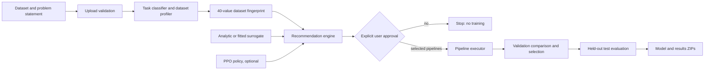

# RL-AutoML

RL-AutoML is a tabular AutoML prototype that separates experiment planning from model training with a mandatory human approval gate. It profiles a dataset, infers or accepts the task contract, builds a fixed-size fingerprint, proposes finite model/preset/preprocessing experiments, and only trains the experiments a user explicitly approves. Successful runs evaluate the selected model once on a held-out test split and produce verified ZIP artifacts.

The project is designed for honest experimentation, not autonomous production deployment. Recommendation scores and PPO pretraining results may come from a surrogate simulator; they are estimates, not measured model performance.

## Safety contract: planning is not training

The lifecycle is deliberately split:

1. `plan()` profiles and recommends. It trains no candidate model.
2. A user reviews the printed or API-returned recommendations.
3. `approve()` records an explicit selection. It still trains nothing.
4. `execute()` checks that approval exists, trains only approved pipelines, selects using validation data, then unlocks the held-out test split for final evaluation.

Calling `execute()` without approved experiments raises `NotApprovedError`. The API has the same boundary: creating a run stops at `awaiting_approval`; only `POST /runs/{id}/approve` can start execution. Do not build automation that approves runs implicitly.

## Architecture



ASCII equivalent:

```text
Dataset + intent
      |
      v
validation -> task/profile -> fingerprint -> planner (surrogate + optional PPO)
                                              |
                                              v
                                     recommendations only
                                              |
                                    EXPLICIT APPROVAL GATE
                                              |
                                              v
                                  approved real experiments
                                              |
                         validation selection -> held-out test
                                              |
                                              v
                                  verified model/results ZIPs
```

Key boundaries:

- `rl_automl/orchestrator.py` is the shared run state machine for programmatic and API use.
- `rl_automl/environment/` contains the finite action space, state encoder, reward, analytic/fitted surrogate, and simulator.
- `rl_automl/agent/` contains PPO actor/critic and checkpoint logic. It does not import the execution layer.
- `rl_automl/search/` owns the model registry and recommendation construction.
- `rl_automl/execution/` owns splits, preprocessing, training, resource accounting, evaluation, and comparison.
- `rl_automl/packaging/` exports the selected pipeline and verifies archives and prediction reloads.
- `rl_automl/api/` wraps the same orchestrator with background runs and server-sent events.
- `rl_automl/training/train_rl.py` trains task-specific PPO policies in the surrogate environment.

The registry currently describes 17 algorithms across classification, regression, clustering, anomaly detection, and dimensionality reduction. The default config enables six common supervised models; optional dependencies determine which can actually run.

## Requirements and installation

Python 3.10 or newer is required. From the repository root:

```bash
python -m venv .venv
# Windows cmd.exe:
.venv\Scripts\activate
python -m pip install --upgrade pip
python -m pip install -e .
```

Install only the extras needed for your workflow:

```bash
python -m pip install -e ".[models]"        # XGBoost and LightGBM
python -m pip install -e ".[rl]"            # PyTorch and PPO training/loading
python -m pip install -e ".[api]"           # FastAPI, Uvicorn, multipart uploads
python -m pip install -e ".[onnx]"          # optional ONNX export and verification
python -m pip install -e ".[openml]"        # opt-in OpenML datasets
python -m pip install -e ".[cli]"           # Rich (reserved for the packaged CLI)
python -m pip install -e ".[dev]"           # tests, lint, typing, plots
# Everything commonly used during development:
python -m pip install -e ".[models,rl,api,dev]"
```

ONNX output is disabled by default and is skipped unless its extra is installed. OpenML sources require both the extra and network access. Core and demo datasets work offline.

## Quick start: guarded end-to-end demo

The demo uses the local `churn_demo_small` source, prints the plan, asks for approval, trains only after approval, and walks through generated artifacts:

```bash
python scripts/demo.py
```

For non-interactive use, approval must still be explicit in the command:

```bash
python scripts/demo.py --yes --approve 1,2 --time-budget-s 120 --memory-budget-mb 2048
```

`--yes` means "I authorize real model training." Without `--yes`, a non-interactive process exits before `approve()` and `execute()`. Use `python scripts/demo.py --help` for all controls.

## Programmatic example

```python
from rl_automl.core.config import AutoMLConfig
from rl_automl.dataset.loaders import load_source
from rl_automl.orchestrator import AutoMLOrchestrator, PlanRequest

config = AutoMLConfig.load()
frame, source = load_source("iris")
orchestrator = AutoMLOrchestrator(config)

run = orchestrator.plan(
    PlanRequest(
        problem_statement="Predict species from flower measurements",
        frame=frame,
        dataset_name=source.name,
        target=source.target,
        task_type=source.task_type,
        metric=source.effective_metric(),
    )
)

for item in run.rl_recommendations:
    print(item.rank, item.model, item.expected_performance, item.expected_cost)

# Deliberate, auditable user decision. This call does not train.
run = orchestrator.approve(run, selection=[1], approved_by="example-user")
# Training starts here, and nowhere above.
run = orchestrator.execute(run, frame=frame)
print(run.status, run.artifacts.model_zip, run.artifacts.results_zip)
```

## API

Start the service from the repository root:

```bash
python -m uvicorn rl_automl.api.app:app --host 127.0.0.1 --port 8000
```

Interactive OpenAPI documentation is at `http://127.0.0.1:8000/docs`.

A complete API flow using a bundled source:

```bash
curl -X POST http://127.0.0.1:8000/datasets/from-source \
  -H "Content-Type: application/json" \
  -d '{"source":"iris"}'

curl -X POST http://127.0.0.1:8000/runs \
  -H "Content-Type: application/json" \
  -d '{"source":"iris","problem_statement":"Predict species","target":"species","task_type":"classification","metric":"f1","use_policy":true}'

curl http://127.0.0.1:8000/runs/RUN_ID/recommendations

# This explicit request is the approval gate and starts background execution.
curl -X POST http://127.0.0.1:8000/runs/RUN_ID/approve \
  -H "Content-Type: application/json" \
  -d '{"selection":[1,2],"approved_by":"alice"}'

curl -N http://127.0.0.1:8000/runs/RUN_ID/events
curl http://127.0.0.1:8000/runs/RUN_ID
curl -o model_package.zip http://127.0.0.1:8000/runs/RUN_ID/artifacts/model.zip
curl -o results.zip http://127.0.0.1:8000/runs/RUN_ID/artifacts/results.zip
```

Uploads use `POST /datasets` with multipart field `file`. Other endpoints include `GET /datasets`, `GET /runs`, `POST /runs/{id}/cancel`, and `GET /runs/{id}/artifacts`.

## Command-line entry points

The reliable command-line modules in this checkout are:

```bash
python scripts/demo.py --help
python scripts/build_meta_dataset.py --help
python -m rl_automl.training.train_rl --help
python -m rl_automl.training.train_rl --quick --task-type classification
```

`pyproject.toml` declares an `automl` console entry point, but `rl_automl/cli/main.py` is not present in this checkout. Do not depend on `automl plan`, `automl run`, or related commands until that module is implemented. The API, orchestrator, and scripts above are the supported interfaces documented here.

## Configuration and environment variables

Configuration precedence, lowest to highest, is:

1. Pydantic model defaults.
2. The path passed to `AutoMLConfig.load(path)`, `AUTOML_CONFIG`, or `configs/default.yaml`.
3. Environment variables using `AUTOML_<SECTION>__<FIELD>`.

Values are YAML-parsed, so numbers, booleans, nulls, and lists retain their types. Examples for Windows `cmd.exe`:

```cmd
set AUTOML_CONFIG=configs/default.yaml
set AUTOML_RUNTIME__ARTIFACTS_DIR=artifacts_local
set AUTOML_RUNTIME__LOG_LEVEL=ERROR
set AUTOML_SEARCH__MAX_EXPERIMENTS=4
set AUTOML_SEARCH__TIME_BUDGET_S=300
set AUTOML_RL__ENABLED=false
set AUTOML_PACKAGING__INCLUDE_ONNX=false
```

Important sections from `configs/default.yaml`:

| Section | Purpose | Notable defaults |
|---|---|---|
| `runtime` | artifact root, seed, jobs, logging | `artifacts`, seed `1234`, `n_jobs: -1` |
| `security` | upload, shape, name, and archive limits | 512 MB upload; 5M rows; 5000 columns |
| `task` | metric overrides and optional LLM hook | rule-based by default; minimum confidence `0.35` |
| `dataset` | train/validation/test split and profiling | `0.6/0.2/0.2`, stratified where applicable |
| `search` | experiment count and resource budgets | max 12; 3600 s; 8192 MB; 3 recommendations |
| `rl` | policy path, PPO hyperparameters, reward weights | enabled; 200k surrogate steps; device `auto` |
| `models` | enabled registry keys and cost reference | logistic regression, forests, XGBoost, LightGBM, MLP |
| `execution` | CV, failure isolation, parallelism | holdout mode, no fail-fast, one pipeline at a time |
| `packaging` | model/results packaging and ONNX | results and README on; ONNX off |
| `memory` | future/optional metadata persistence | DB path `artifacts/memory.db` |
| `api` | bind address, CORS, concurrency | `127.0.0.1:8000`, two concurrent runs |

Budget limits are best-effort process controls, not hard OS/container quotas. `n_jobs: -1` may use all available cores. Review these values before allowing untrusted or expensive runs.

## Artifacts

A typical artifact tree is:

```text
artifacts/
  datasets/                       # validated API-managed datasets
  meta/
    surrogate_meta.jsonl          # default output of build_meta_dataset.py
    openml/                       # optional cached network datasets
  policies/
    ppo_policy_classification.pt
    ppo_policy_regression.pt
    training_report.json          # explicitly labelled simulated evaluation
  runs/
    RUN_ID/
      run.json                    # task, plan, approval, events, results, config snapshot
      package/
        model.joblib
        metadata.json
        model_loader.py
        predict.py
        README.md
        requirements.txt
      model_package.zip           # verified deployable bundle
      results.zip                 # results, comparison, history, search statistics
```

Exact package members can vary with model and optional ONNX support. Download endpoints only serve paths resolved inside the configured artifact root. SHA-256 values are recorded in the run object.

## Building a real meta-dataset

This command executes a deliberately small, budgeted set of real experiments and writes one JSON object per result with the fields expected by `SurrogateModel.fit`:

```bash
python scripts/build_meta_dataset.py \
  --datasets iris diabetes \
  --experiments-per-dataset 2 \
  --time-budget-s 120 \
  --memory-budget-mb 2048 \
  --output artifacts/meta/surrogate_meta.jsonl \
  --yes
```

The script refuses to run experiments without `--yes`; unlike the interactive demo, there is no prompt fallback. Rows contain fingerprint, task type, model key, preset index/count, preprocessing, feature selection, measured validation score, measured training time, memory, and failure metadata. Failed experiments use a finite fallback score and preserve their failure flag/error so the JSONL remains fit-compatible. A fitted surrogate currently requires at least 50 rows; smaller files are valid collection batches but leave the analytic prior active.

## RL training semantics and baseline caveat

`python -m rl_automl.training.train_rl` trains PPO against `SurrogateModel`, not by repeatedly fitting real models. The surrogate starts as a deterministic analytic prior and can blend gradient-boosted regressors fitted on real meta rows. This makes thousands of environment steps affordable, but it changes the meaning of every reported number:

- PPO training rewards are simulator rewards.
- Planner scores in the training report are surrogate estimates, not measured accuracy/F1/RMSE.
- A policy checkpoint is evidence that optimization ran, not evidence that the planner generalizes.
- Real validation/test metrics appear only after approved execution in the real executor.

The current measured surrogate-only comparison did **not** establish superiority over random search: trained PPO scored about `0.999`, random about `0.995`, and an untrained policy about `0.921` in that run. The difference is tiny, the scores are surrogate estimates, and they must not be advertised as real benchmark results. A fair RL-vs-random/greedy/grid conclusion requires identical real budgets, multiple datasets/seeds, uncertainty intervals, and paired significance testing. That complete real-environment baseline study is not present in this checkout.

## Testing and quality checks

Install development dependencies, then run:

```bash
python -m pytest
python -m pytest -m "not slow and not network and not rl"
python -m pytest -m rl
python -m ruff check rl_automl scripts
python -m mypy rl_automl
python scripts/demo.py --help
python scripts/build_meta_dataset.py --help
```

The repository currently contains only `rl_automl/tests/__init__.py`; the broader test suite described by the architecture has not yet been added. Therefore a zero-test pytest invocation is not evidence that the system is fully verified. Use the guarded demo for an integration check and inspect `run.json`, checksums, and ZIP contents.

## Limitations

- This is an early-stage prototype (version `0.1.0`), not a managed production service.
- The packaged `automl` CLI target is declared but its implementation is absent in this checkout.
- Automated test coverage is currently incomplete.
- PPO pretraining and its holdout comparison are surrogate-only; no real baseline superiority claim is supported.
- A fitted surrogate needs at least 50 real meta rows and may inherit dataset/registry bias.
- Memory persistence and baseline/evaluation packages are incomplete or absent; run JSON files are the primary persistence mechanism.
- Unsupervised execution paths exist but have less end-to-end evidence than supervised classification/regression.
- API run work is process-local. Treat restarts, multi-process deployment, authentication, authorization, rate limiting, and durable queues as deployment work still to do.
- CORS defaults to `*`; lock it down before exposing the API.
- Resource budgets are not a security sandbox. Use container/OS quotas for untrusted workloads.
- Optional model failures are isolated, but recommendations can still include a model whose optional dependency is unavailable.
- Task inference is heuristic. Supply `target`, `task_type`, and `metric` for consequential runs.
- Model selection uses validation evidence; the held-out test is evaluated only after selection, but repeated human reruns can still create operational test-set leakage.
- ONNX export is optional and disabled by default.

## License

MIT, as declared in `pyproject.toml`.
